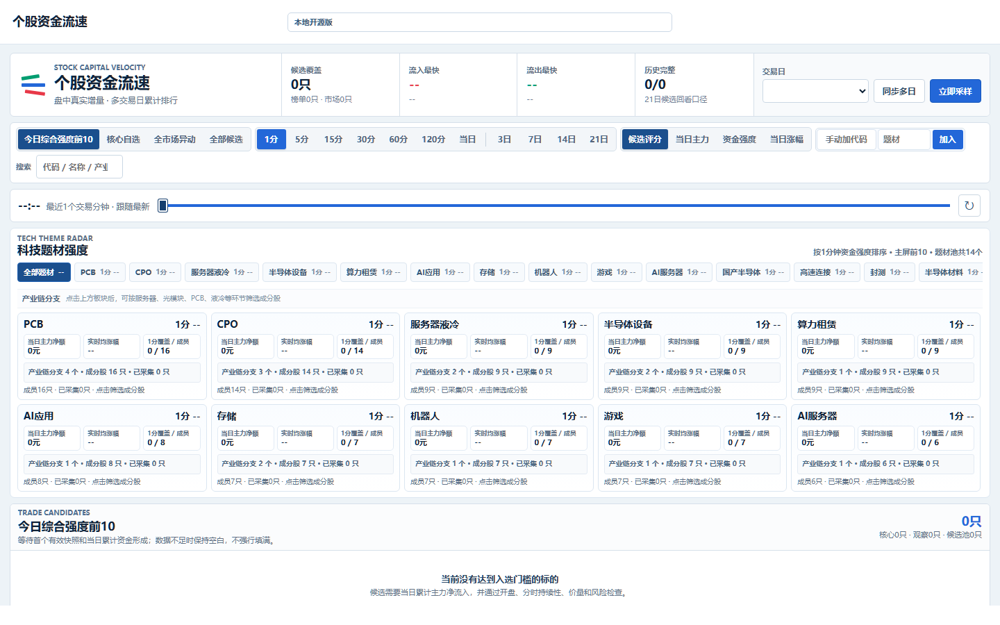
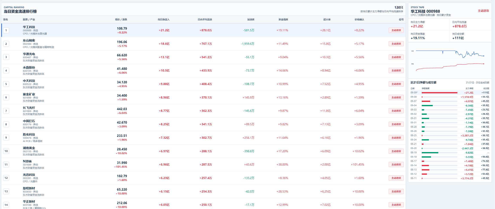

# 个股资金流速 · A 股盘中资金流监控页面

一个轻量、本地优先的 A 股盘中资金流监控页面。它从公开行情接口采集资金流快照，计算分钟增量、短线流速和多日累计，并按题材、产业链分支和个股展示结果，适合个人研究、盘中观察和二次开发。



资金流速排行榜与个股详情：



> 页面截图仅用于展示界面结构，截图中的行情数据不是实时承诺，也不构成投资建议。

## 主要功能

- 资金流速总览：按 1 分钟、5 分钟、15 分钟、30 分钟、60 分钟和更长窗口观察变化。
- 题材雷达：聚合题材资金强度、流入速度、涨跌表现和产业链分支。
- 个股候选：展示核心标的、资金流入、加速度、资金强度和价格确认等指标。
- 个股明细：按股票查看分时流速、历史累计和候选后验验证。
- 本地配置：自选股、题材和产业链映射均使用 JSON 文件维护，运行数据保存在本机。
- 零依赖启动：后端只使用 Python 标准库，不需要安装第三方包，不需要 AI 服务或 API Key。

## 快速开始

环境要求：Python 3.10 或更高版本。

```powershell
python server.py
```

然后打开 <http://127.0.0.1:4176/>，点击“立即采样”读取公开行情。首次采样后，数据会写入本地 `data/stock_fund_flow.db`；该数据库已被 `.gitignore` 忽略，不会提交到 GitHub。

如需更换端口：

```powershell
$env:STOCK_FLOW_PORT=4177
python server.py
```

更完整的页面操作说明见 [使用说明](docs/usage.md)。

## 配置题材和个股资料库

公共配置位于 `data/`：

- `a_share_watchlist.json`：默认核心自选股。
- `a_share_theme_pool.json`：题材、产业链分支和题材成员股。
- `a_share_manual_pool.json`：当前本地实例通过“手动加代码”添加的股票，不建议提交个人临时内容。

其他人通过 Pull Request 增加公共个股或题材，字段和审核规则见 [题材与个股库协作方案](docs/library-plan.md) 与 [贡献指南](CONTRIBUTING.md)。

## API

- `GET /api/stock-fund-flow`：读取页面数据，支持 `scope`、`window`、`period`、`sort`、`date`、`slot`、`q`、`branch`、`code`。
- `GET /api/stock-fund-flow/validation`：读取候选后验验证结果。
- `GET /api/health`：检查服务状态和数据源标识。
- `POST /api/stock-fund-flow/refresh`：采集当前公开资金流快照。
- `POST /api/stock-fund-flow/history/refresh`：补录日线历史。
- `POST /api/stock-fund-flow/manual`：加入本地手动盯盘股票。

## 项目结构

```text
index.html                 页面入口
app.js                     页面交互和数据渲染
stock-flow.css              页面专用样式
styles.css                 基础布局与响应式样式
server.py                  本地 HTTP 服务和 API
connectors/                公开行情采集连接器
data/                      题材、自选股等 JSON 配置
docs/                      使用、协作和页面预览文档
tools/                     配置校验工具
```

## 数据来源与免责声明

页面默认读取公开行情接口。接口可能限流、延迟或调整字段，数据完整性和可用性取决于外部服务。页面展示的是数据事实和计算结果，仅供学习、研究和软件开发使用，不构成任何投资建议。
